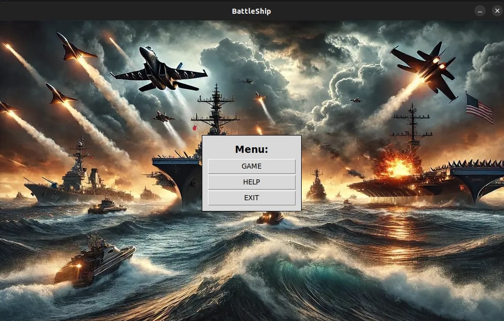
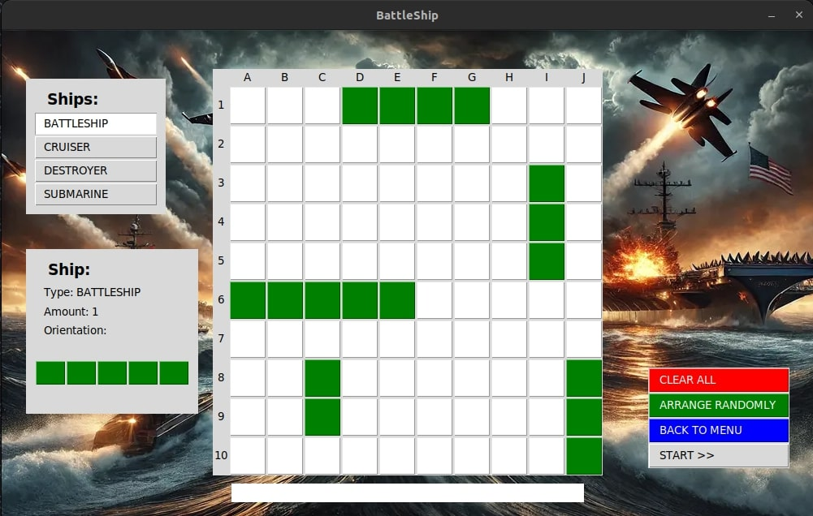
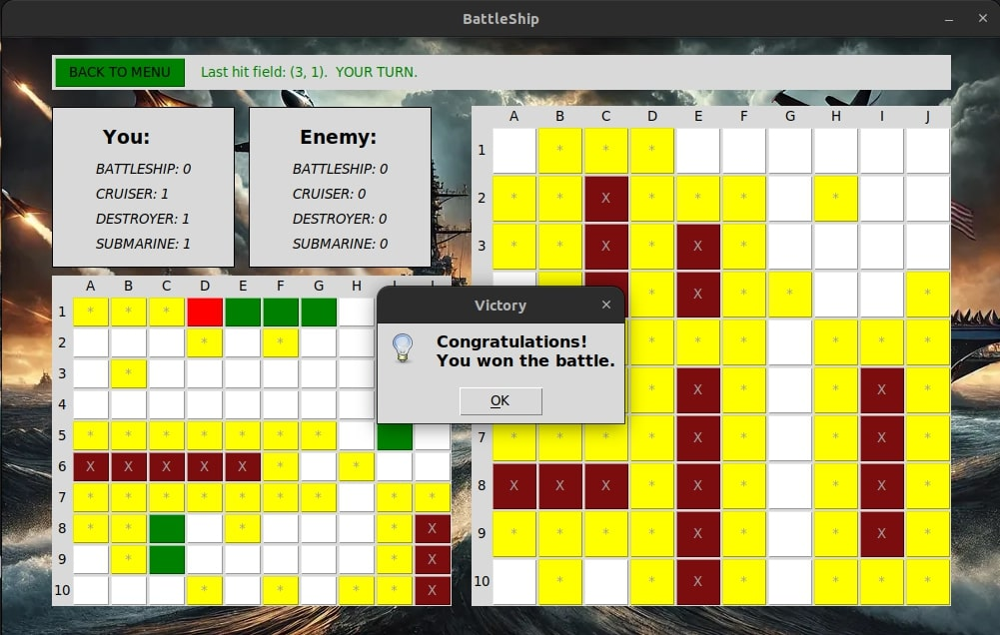

## Battleships
- Made by Mihnea-Gabriel Popescu & Dana-Maria Caruntu 321CA

* This is a repository for the Battleships game implemented in Python.      
* It contains the necessary code and files to run the game.    

The main purpose of this project is to showcase the implementation    
of the board game Battleships using Python programming language with OOP concepts.

## Game Description

Battleships is a two-player strategy guessing game where players take turns calling
shots to locate and destroy the opponent's hidden fleet of warships. The game is played
on grids where each player's fleet is placed in secret. The goal is to sink all the opponent's ships.
There are 5 ships in total, each taking up a certain number of squares on the grid:
- Battleship (5 squares) - one ship
- Cruiser (4 squares) - one ship
- Destroyer (3 squares) - two ships
- Submarine (2 squares) - one ship
The grid is a 10x10 matrix where each square is identified by a letter and a number.

## Features & Technologies
- Gameplay with ship placement and rotation.
- Collision detection to ensure blocks fit within the game grid.
- Sound effects when:
    - a ship is hit
    - water is hit
    - the game is lost
    - the game is won
    - background music
- Programming Language : Python with **pygame** library api, **random** library,
**tkinter** library, **random** library, **datetime** library.

## Run instructions & Usage

To run the game, make sure you have Python installed on your system.         
Then, simply execute the main Python file to start playing the game (command: python3 main.py or simply 
run the game from pycharm).

## Details about implementation

Implemented in OOP manner, the program contains the following classes:
* `ai.py` - Contains a simple Battleship bot that begins by randomly selecting
    untried coordinates to shoot and then transitions to a targeted approach—tracking hits 
    marking cells on an internal grid, and firing around known hits until it sinks the opposing ship.

* `board.py` - Contains a function named get_random_player() that repeatedly picks random
    coordinates and orientations to place ships on a player's map until all required ships
    have been successfully positioned, returning the fully populated Player object.

* `game_env_interface.py` - Contains a comprehensive Battleship game interface built using Tkinter,
    where the player arranges ships, interacts with an opposing AI, and views in-game feedback for hits,
    misses, and destroyed ships. This file defines multiple classes:
    - **`MapBuilder`**  
      Dynamically generates a 10×10 grid of clickable buttons for positioning ships and tracking shots.
      It uses helper methods to bind mouse events (hover, leave, right-click) so the rest of the application
      can highlight or rotate ships as the player hovers or clicks.

    - **`StatusBuilder`**  
      Displays how many ships of each type have been placed (battleship, cruiser, destroyer, and submarine),
      refreshing these counts as the player arranges their vessels.

    - **`MenuFrame`**  
      Houses the main menu buttons—Start, Help, Exit—and takes care of placing or removing its UI elements at the
      center of the window.

    - **`ArrangeFrame`**  
      Where the player selects a ship type to place, clicks on the grid to position it, and can rotate ships or
      auto-fill them randomly. It updates warnings if you can’t place a ship in a certain spot, or if all ships have
      been set.

    - **`GameFrame`**  
      Once ships are arranged, manages the actual gameplay. It tracks each shot, indicates hits or misses
      (including sound effects), and handles transitions between the player’s turn and the AI’s turn, as well as
      the end-of-game outcome (victory/defeat).

    - **`HelpFrame`**  
      Shows a separate help screen with game instructions and a back button for returning to the main menu.

* `exceptions.py` - Extends the built-in Exception to handle ship-specific errors by storing a descriptive
      message along with additional error details or codes for precise error handling.

* `constants.py` - This file centralizes all static configuration details for the Battleship game,
      including ship configurations, timing constants, user interface strings for menus, status messages,
      game frames, help content, custom exception identifiers, window dimensions, and color schemes, providing 
      a single source for the game's constants and resource definitions.

* `main.py` - Entry point of the program : handles the action of the user and translated them
              into gameplay.

* `resources` - Directory that contains 5 audio files for the game features (interaction
                music and the background).

## Each member's contribution for the TEAM

**Popescu Mihnea-Gabriel**
  - Primarily responsible for core logic, structure, and backend functionality.
  - Worked on initial setup, refactoring files, fixing utilities, and integrating essential game components like player and ship classes.
  - Refined the main application logic, addressed bugs (in game environment interface, utils, etc.), and added resources for enhanced gameplay.
  - Improved constants, and incrementally built and refined the map, status, and game frames.

**Caruntu Dana-Maria**
  - Concentrated on user interface, effects, AI integration, and enhancing user interactions.
  - Implemented and improved frames such as HelpFrame, GameFrame, and ArrangeFrame, and integrated sound effects.
  - Added features like additional buttons, UI interactions (mouse click handling), and visual enhancements.
  - Contributed to bot implementation, fixing board functionalities, and providing UI polish and extended functionalities like status
    updates and game environment interfaces.
  - Created README.md

Each member wrote about 850 lines of code.

**NOTE : Each member of the team has worked remotely, pushed their own**         
**contribution on github(https://github.com/mihneapopesq/Battleships)**

**Difficulties & Solutions**

* Initially, we wanted the game to be a 1v1 multiplayer experience, but we realized it
would be more fun and engaging to play against a bot, so we shifted our focus accordingly.

* We encountered a bug in our constants due to misinterpreting the dimensions of the ships,
which prevented us from playing the game. Once we corrected our understanding and fixed the constants,
the gameplay worked.

* We also encountered some difficulities during the implementation of block rotation  
because they were getting out of the grid. To solve the problem, we came up     
with a new rotation condition that checks if the blocks still fit in the grid during rotation.

Feel free to explore the code and make any modifications or improvements as needed. Contributions are welcome!     

**NOTE: For more details about implementation check files.**